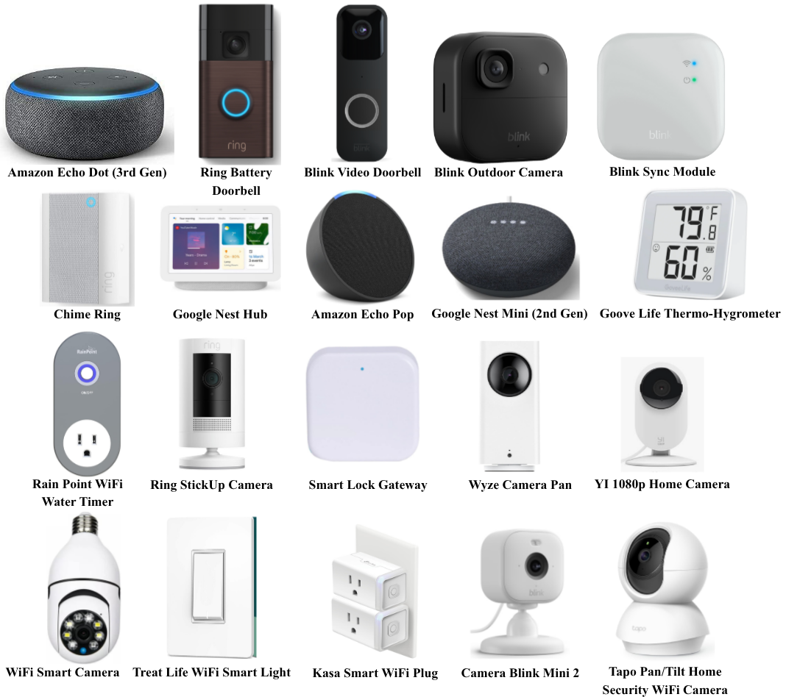

# CU2025

## Concordia University IoT Devices Dataset

The **CU2025 Dataset** contains network traffic collected from 27 IoT devices.



The list of the devices with their details follows.

| Sr.  | MAC Address | Device Name | Device Model | Device Instance |
| ------------- | ------------- | ------------- | ------------- | ------------- |
| 1  | 08:12:A5:E0:5F:36  | Amazon Echo Dot (3rd Gen)  | C78MP8  | 1 of 1 |
| 2  | 18:7F:88:D4:C3:62  | Ring Battery Doorbell  | 5F97F2  | 1 of 1  |
| 3  | E8:4C:4A:B7:1B:DB  | Blink Video Doorbell  | BDM00200U  | 1 of 1  |
| 4  | DC:A0:D0:E1:AC:68  | Blink Outdoor Camera  | BCM00500U  | 1 of 1  |
| 5  | 68:13:F3:5E:E0:0A  | Blink Sync Module  | BSM00401U  | 1 of 1  |
| 6  | 5C:47:5E:90:26:06  | Chime Ring  | 5F67E9  | 1 of 1  |
| 7  | 1C:53:F9:CE:28:CD  | Google Nest Hub  | GUIK2  | 1 of 1  |
| 8  | 9C:C8:E9:82:95:31  | Amazon Echo Pop  | C2H4R9  | 1 of 1  |
| 9  | BC:DF:58:0A:CA:54  | Google Nest Mini (2nd Gen)  | H2C  | 1 of 1  |
| 10  | 60:74:F4:BB:B2:8E  | Goove Life Thermo-Hygrometer  | H5103  | 1 of 1  |
| 11  | Content Cell  | Content Cell  | Content Cell  | Content Cell  |
| 12  | Content Cell  | Content Cell  | Content Cell  | Content Cell  |
| 13  | Content Cell  | Content Cell  | Content Cell  | Content Cell  |
| 14  | Content Cell  | Content Cell  | Content Cell  | Content Cell  |
| 15  | Content Cell  | Content Cell  | Content Cell  | Content Cell  |
| 16  | Content Cell  | Content Cell  | Content Cell  | Content Cell  |
| 17  | Content Cell  | Content Cell  | Content Cell  | Content Cell  |
| 18  | Content Cell  | Content Cell  | Content Cell  | Content Cell  |
| 19  | Content Cell  | Content Cell  | Content Cell  | Content Cell  |
| 20  | Content Cell  | Content Cell  | Content Cell  | Content Cell  |
| 21  | Content Cell  | Content Cell  | Content Cell  | Content Cell  |
| 22  | Content Cell  | Content Cell  | Content Cell  | Content Cell  |
| 23  | Content Cell  | Content Cell  | Content Cell  | Content Cell  |
| 24  | Content Cell  | Content Cell  | Content Cell  | Content Cell  |
| 25  | Content Cell  | Content Cell  | Content Cell  | Content Cell  |
| 26  | Content Cell  | Content Cell  | Content Cell  | Content Cell  |
| 27  | Content Cell  | Content Cell  | Content Cell  | Content Cell  |

## Dataset Download

You can download the **CU2025 Dataset** using the link provided in [`CU2025_PCAP.txt`](CU2025_PCAP.txt).

## Combining PCAP Files

After downloading the ZIP file, you will find that the traffic for each device is distributed across multiple PCAP files.

To combine the PCAP files for a device into a single PCAP file, you can use the following script:

```bash
python combinecode.py
```
The script combines the individual PCAP files and generates a single output file named **merged_output**.

## Converting PCAP files to CSV

Once the PCAP files have been combined, you can convert the network traffic data from PCAP format to CSV format.

For this purpose, you can use:


```bash
python Scapy.py
```

Depending on your requirements, you may need to modify Scapy.py to extract additional features or customize the features included in the resulting CSV files.

## Adding Device Labels

If you would like to add labels corresponding to the IoT devices to the extracted data, you can use:

```bash
python label.py
```

This can be useful for machine learning and classification tasks where each network traffic record needs to be associated with its corresponding IoT device.

## Workflow

The recommended workflow is:

1. Download the dataset using the link provided in CU2025_PCAP.txt.

2. Extract the downloaded ZIP file.

3. Use combine code.py to combine multiple PCAP files into a single PCAP file for each device.

4. Use Scapy.py to convert the PCAP files into CSV files and extract the required network features.

5. Use label.py to add device labels if required.

## Files

| File                | Description   |
| -------------       | ------------- |
| ['CU2025_PCAP.txt'](CU2025_PCAP.txt)    | Contains the download link for the CU2025 Dataset  |
| ['combinecode.py'](combinecode.py)     | Combines multiple PCAP files into a single PCAP file  |
| ['Scapy.py'](Scapy.py)            | Converts PCAP files to CSV and extracts network traffic features  |
| ['Label.py'](Label.py)            | Adds labels corresponding to the IoT devices  |

## Note
* The feature extraction process in [`Scapy.py`](Scapy.py) can be customized depending on the requirements of your research or analysis.
* The labeling step is optional and can be performed if device-level labels are required.
* Make sure the required Python dependencies are installed before running the scripts.


